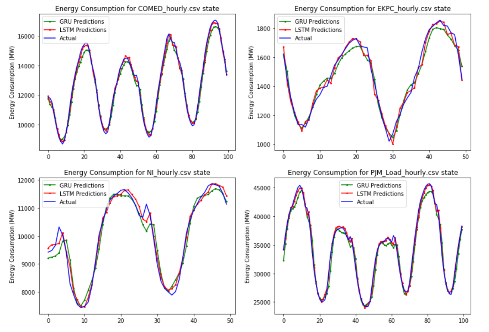

# Energy consumption prediction using LSTM/GRU networks in PyTorch

## Project Overview
An hourly energy consumption prediction service for PJM Interconnection LLC Energy Consumption dataset based on GRU/LSTM networks using PyTorch framework.

In this project, I will use GRU and LSTM models for a time series prediction task. The goal is to **create a model that can accurately predict energy usage in the next hour** given historical consumption data provided by PJM Interconnection LLC Energy Consumption Dataset. I will be using both the GRU and LSTM model to train on a set of historical data and evaluate both models on an unseen test set. To do so, I'll start with feature selection, data-preprocessing, followed by defining, training, and eventually evaluating the models. I will use the PyTorch library to implement both types of models along with other common Python libraries used in data analytics. Finally, I will compare the performance of the GRU model against an LSTM model as well. 

---
## Preparing the environment
**Note**: I have tested this project on __Linux__. It can surely be run on Windows and Mac with some little changes.

Before you can experiment with the code, you'll have to make sure that you have all the libraries and dependencies required to support this project. You will mainly need Python 3, PyTorch and its torchvision, OpenCV, Matplotlib, and tqdm.

1. Clone the repository, and navigate to the downloaded folder.


2. Create (and activate) a new environment, named `energy_env` with Python 3.8. If prompted to proceed with the install `(Proceed [y]/n)` type y.

	```shell
	conda create -n energy_env python=3.8
	source activate energy_env
	```
	
	At this point your command line should look something like: `(energy_env) <User>:energy-consumption-prediction  <user>$`. The `(energy_env)` indicates that your environment has been activated, and you can proceed with further package installations.

6. Before you can experiment with the code, you'll have to make sure that you have all the libraries and dependencies required to support this project. You will mainly need Python3.8+, PyTorch and its torchvision, and Matplotlib. You can install dependencies using:
```
pip install -r requirements.txt
```

7. Navigate back to the repo. (Also, your source environment should still be activated at this point.)
```shell
cd energy-consumption-prediction 
```

8. Open the directory of notebooks, using the below command. You'll see all the project files appear in your local environment; open the first notebook and follow the instructions.
```shell
jupyter notebook
```

9. Once you open any of the project notebooks, make sure you are in the correct `energy_env` environment by clicking `Kernel > Change Kernel > energy_env`.


### Data

The dataset that we will be using is the [PJM Interconnection LLC Energy Consumption Dataset](https://www.kaggle.com/robikscube/hourly-energy-consumption) provided by Kaggle. The dataset contains power consumption data across different regions around the United States recorded on an hourly basis.

Please download data and put it under the `data` subdirectory. 

### Use the pre-trained model

You can use my pre-trained models for your own experimentation. I put them in the `models` directory.

## Results
While the GRU model may have made smaller errors and edged the LSTM model slightly in terms of sMAPE (Symmetric Mean Absolute Percentage Error), the difference is insignificant and thus inconclusive. There have been many other tests conducted by others comparing both these models but there has largely been no clear winner as to which is the better architecture overall. 

Here are samples of energy consumption prediction results on test set for four different regions:


It looks like the models are largely successful in predicting the trends of energy consumption. While they may still get some changes wrong, such as delays in predicting a drop in consumption, the predictions follow very closely to the actual line on the test set. This is due to the nature of energy consumption data and the fact that there are patterns and cyclical changes that the model can account for. Tougher time-series prediction problems such as stock price prediction or sales volume prediction may have data that is largely random or doesn’t have predictable patterns, and in such cases, the accuracy will definitely be lower.


